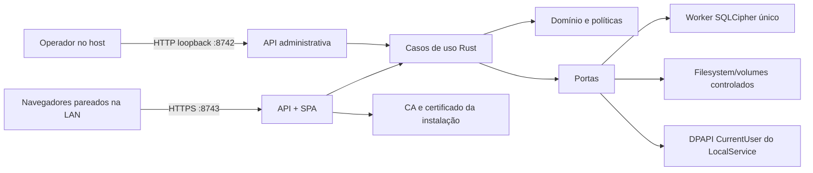

# Arquitetura

## Objetivo e estado

O Offline Dental System é um servidor web local para uma clínica. Um serviço nativo Rust no Windows 11 mantém o SQLCipher e expõe uma SPA React por HTTPS para até 20 navegadores na mesma LAN. Não depende de internet, nuvem, Docker, Redis, Node ou Rust em produção.

Esta etapa cobre fundação, setup inicial, autenticação do `MASTER_ADMIN`, sessão e preparação operacional. Pacientes, agenda, prontuário, odontograma, financeiro, perfis adicionais e restauração completa continuam fora do escopo.

## Contexto



O frontend é uma fronteira não confiável. Navegação, validação de experiência e estado visual ficam em React; autorização, validação decisiva, persistência, criptografia, paths e auditoria ficam em Rust.

## Processos e listeners

| Componente    | Bind                   | Disponibilidade    | Responsabilidade                                      |
| ------------- | ---------------------- | ------------------ | ----------------------------------------------------- |
| administração | `127.0.0.1:8742`       | sempre             | health local, setup, volumes e abertura de pareamento |
| aplicação LAN | `0.0.0.0:8743` com TLS | somente em `READY` | SPA, login, sessão e APIs autenticadas                |
| descoberta    | mDNS                   | somente em `READY` | anunciar `dental-<installation-id>.local`             |

O roteador administrativo não registra rotas de setup no listener LAN. A separação é estrutural e também testada; não depende de esconder botões no React.

## Camadas

| Camada           | Responsabilidade                                    | Restrições                                                          |
| ---------------- | --------------------------------------------------- | ------------------------------------------------------------------- |
| `src/`           | React, acessibilidade, formulários e adapter HTTP   | sem SQL, filesystem, chaves, token em storage ou regra autoritativa |
| `http`           | DTO HTTP, cookies, headers, status e erros públicos | handlers finos; sem SQL e sem regra de negócio                      |
| `application`    | casos de uso, sessão, autorização e transações      | depende de portas, não de Axum/React                                |
| `domain`         | modelos, invariantes e validações                   | não depende de transporte ou infraestrutura                         |
| `infrastructure` | SQLCipher, migrations, DPAPI, artefatos e relógio   | não define política de UI                                           |
| `platform`       | serviço Windows, volumes, TLS, mDNS e ACL           | APIs específicas e fail-closed fora do alvo                         |

Fluxo obrigatório:

```text
componente React → adapter fetch → handler Axum → caso de uso → porta/repository
```

Respostas públicas de erro têm `code`, `message`, `correlationId` e, quando aplicável, `fieldErrors`. Causas internas e payloads sensíveis não são serializados nem registrados.

## Persistência e concorrência

- SQLCipher é aberto apenas pelo serviço e recebe a chave antes de qualquer consulta.
- Um worker bloqueante serializa a conexão; não existe pool concorrente de escrita.
- WAL permanece no mesmo disco local, com transações curtas e `foreign_keys=ON`.
- Migrations são forward-only, embutidas e aplicadas em ordem.
- `SessionStore` usa o mesmo SQLCipher, mas persiste somente hashes de tokens/CSRF.
- IDs UUIDv7 e timestamps UTC/RFC3339 são gerados na aplicação.
- Banco, WAL, chaves e staging vivem em `%ProgramData%\OfflineDentalSystem`, sob ACL do serviço.
- SMB, UNC, symlinks/reparse points não autorizados e paths fornecidos livremente pelo navegador são rejeitados.

## Navegador e cache

O Vite gera assets locais incorporados no binário Rust. O servidor aplica CSP e headers defensivos. A PWA instala apenas manifest, ícones e shell estático versionado.

- `fetch` usa a mesma origem e cookies `credentials: same-origin`;
- nenhuma credencial entra em `localStorage`, `sessionStorage` ou IndexedDB;
- `/api/` e respostas autenticadas usam `Cache-Control: no-store`;
- o Service Worker não intercepta nem armazena API;
- ao perder a LAN, o shell informa indisponibilidade e não oferece edição offline.

## Autenticação e autorização

Nesta etapa somente o usuário com papel `MASTER_ADMIN` pode autenticar. O servidor verifica Argon2id no banco, aplica rate limit em memória e cria token opaco de sessão. Apenas seu SHA-256 é persistido.

O cookie `__Host-dental_session` é `Secure`, `HttpOnly`, `SameSite=Strict`, `Path=/` e não possui `Domain`. Sessões vencem após 30 minutos ociosos ou 12 horas absolutas. Requisições mutáveis exigem CSRF rotativo, `Origin` e `Host` válidos. RBAC fica preparado no caso de uso; os demais papéis pertencem à fase de identidade.

## TLS e pareamento

Cada instalação possui CA privada e certificado próprios. A CA vale cinco anos; o leaf vale 397 dias e deve ser renovado 30 dias antes. O certificado cobre `localhost` e o hostname mDNS. Chaves privadas e `K_db` são protegidas por DPAPI `CurrentUser` sob o perfil carregado do `LocalService`.

Pareamento abre uma janela de dez minutos com token one-shot e fingerprint SHA-256. Confiar na CA continua sendo uma ação explícita do sistema operacional do cliente. Nenhum dado clínico é servido pelo fluxo de pareamento.

## Serviço e instalação

O binário aceita execução interativa para desenvolvimento e modo de serviço para produção. O MSI previsto:

1. copia somente artefatos compilados;
2. instala o serviço com início automático e SID restrito;
3. aplica ACL de `%ProgramData%\OfflineDentalSystem`;
4. cria firewall somente para Private/Domain na porta 8743;
5. cria atalho do setup loopback;
6. inicia o serviço e abre o navegador após o health check;
7. preserva dados e materiais criptográficos em repair/uninstall.

O projeto prepara e valida a configuração do MSI, mas não assina nem publica artefatos sem licença e certificado aprovados.

## Escolhas deliberadas

- sem Docker: um processo nativo é menor e integra DPAPI/SCM/ACL sem camada adicional;
- sem Redis/Valkey: não há réplicas nem coordenação distribuída;
- sem banco por SMB: clientes acessam somente HTTP(S);
- sem edição offline: evita divergência, fila sensível e dados clínicos no dispositivo;
- sem microserviços: o volume e a topologia não justificam a complexidade.

Consulte os [ADRs](decisions/README.md), o [modelo de segurança](security.md) e o [procedimento Windows](development.md).
