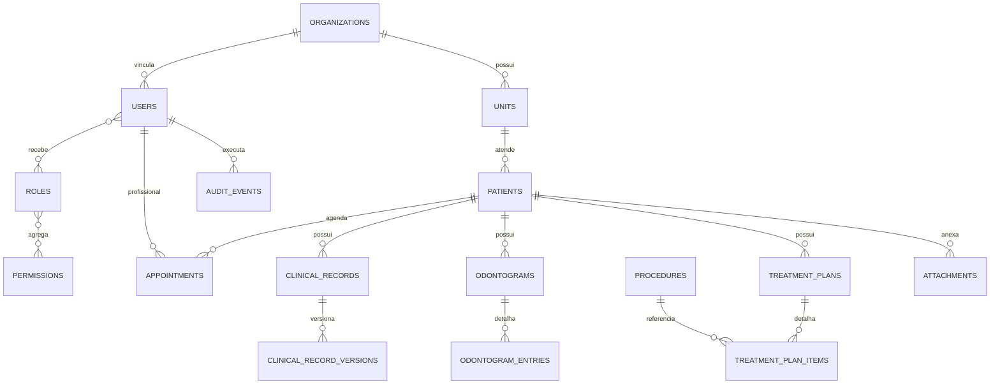

# Modelo de dados

## Convenções

O modelo abaixo é o contrato lógico do MVP. As migrations `0001_foundation.sql` e `0002_web_identity_sessions.sql` contêm somente a fundação e a sessão web implementadas nesta entrega; tabelas futuras não devem ser tratadas como disponíveis até receberem migration e repository próprios.

- SQLite com SQLCipher e `PRAGMA foreign_keys = ON` por conexão.
- IDs UUIDv7 gerados na camada Rust e persistidos como `TEXT`.
- Timestamps em UTC/RFC 3339; horário local é responsabilidade da apresentação.
- Booleanos como `INTEGER` com `CHECK (value IN (0, 1))`.
- Valores monetários, quando necessários, em centavos inteiros e moeda explícita.
- Status com `CHECK` ou tabela de domínio; texto livre não controla workflow.
- Documento, telefone e e-mail são opcionais quando o atendimento social não os possuir.
- Toda tabela mutável possui autoria e timestamps quando a rastreabilidade exigir.

## Relacionamentos principais

## Fundação implementada — schema 2

| Tabela                     | Finalidade atual                                                                               |
| -------------------------- | ---------------------------------------------------------------------------------------------- |
| `installations`            | `database_id`, `key_id`, estado `RECOVERY_PENDING/READY` e versão do schema                    |
| `organizations`            | organização única vinculada à instalação                                                       |
| `units`                    | unidade inicial, responsável e dados administrativos                                           |
| `users`                    | identidade habilitada do master                                                                |
| `user_credentials`         | hash PHC Argon2id separado do perfil                                                           |
| `roles`, `user_roles`      | somente papel `MASTER_ADMIN` e vínculo inicial; permissões ainda futuras                       |
| `installation_settings`    | diretórios distintos e IDs do par recovery/backup vigente; atualização transacional e auditada |
| `recovery_package_history` | referência/hash/verificação do `.odskey`, sem código                                           |
| `backup_history`           | referência/hashes/verificação do `.odsbackup`                                                  |
| `audit_events`             | eventos do setup com triggers contra update/delete                                             |
| `sessions`                 | sessão do master, hashes de token/CSRF, limites de tempo, rotação e revogação                  |

As migrations usam tabelas `STRICT`, constraints, índices e `PRAGMA user_version = 2`. A migration 0002 é forward-only e atualiza a versão da instalação dentro da própria transação; na criação limpa ela é aplicada logo após o registro inicial. Elas não implementam `permissions`, `role_permissions`, patients, agenda, prontuário ou odontograma.

As seções seguintes descrevem o modelo alvo do MVP. Salvo as tabelas listadas acima, são planejamento e não schema executável desta entrega.

## Identidade e organização

| Tabela             | Dados essenciais                                                           | Regras                                                                                 |
| ------------------ | -------------------------------------------------------------------------- | -------------------------------------------------------------------------------------- |
| `organizations`    | nome, identificador, status, timestamps                                    | uma instalação começa com uma organização                                              |
| `units`            | organização, nome, endereço/dados locais, status                           | ao menos uma unidade na configuração inicial                                           |
| `users`            | nome, username normalizado, e-mail, status, lockout e último acesso        | username único; último master não pode ser removido/inativado                          |
| `user_credentials` | usuário, hash PHC e data de alteração                                      | senha nunca reversível; acesso restrito ao serviço de autenticação                     |
| `roles`            | código, nome, escopo e status                                              | códigos de sistema são estáveis                                                        |
| `permissions`      | código e descrição                                                         | catálogo central futuro, não definido na UI                                            |
| `user_roles`       | usuário, papel, unidade/escopo, autoria                                    | unicidade por vínculo ativo                                                            |
| `role_permissions` | papel e permissão                                                          | autorização sempre revalidada no Rust                                                  |
| `sessions`         | usuário, hashes de token/CSRF, criação, último uso, expirações e revogação | nenhum token em claro; 30 min ocioso/12 h absoluto; índices apenas para sessões ativas |

Perfis mínimos planejados: master, administrador, dentista, auxiliar/recepção e somente leitura. O nome do perfil não substitui a checagem da permissão específica.

## Pacientes

| Tabela              | Dados essenciais                                                                                                                 | Regras                                                           |
| ------------------- | -------------------------------------------------------------------------------------------------------------------------------- | ---------------------------------------------------------------- |
| `patients`          | identificador interno, nome, nome social, nascimento, sexo/gênero conforme domínio aprovado, documento opcional, status, autoria | busca não depende de documento; inativação em vez de hard delete |
| `patient_contacts`  | tipo, valor, preferência                                                                                                         | telefone obrigatório somente se a política local exigir          |
| `patient_addresses` | endereço estruturado e período de vigência                                                                                       | histórico preservado quando relevante                            |
| `patient_guardians` | responsável, relação e contato                                                                                                   | suporte a menores e responsáveis legais                          |
| `patient_consents`  | tipo, estado, data, autoria e evidência                                                                                          | alteração gera nova evidência/histórico                          |

Alergias e condições clínicas devem ser estruturadas na anamnese ou em entidade clínica específica; não usar observações livres como única fonte de alertas.

Índices de busca previstos: nome normalizado, nome social normalizado, documento normalizado quando existente, telefone normalizado e identificador interno. Normalização serve somente à busca e não substitui o valor apresentado.

## Agenda e atendimento

| Tabela                       | Dados essenciais                                                         | Regras                                                                     |
| ---------------------------- | ------------------------------------------------------------------------ | -------------------------------------------------------------------------- |
| `appointments`               | unidade, paciente, profissional, início/fim, status, origem e observação | fim posterior ao início; conflito exige permissão e confirmação explícitas |
| `appointment_status_history` | agendamento, origem/destino, usuário, instante, justificativa            | append-only; toda transição é registrada                                   |

Estados alvo: agendado, confirmado, paciente chegou, em atendimento, concluído, cancelado, ausência e encaixe. A máquina de estados ficará no domínio, não em componentes React.

## Prontuário e odontograma

| Tabela                     | Dados essenciais                                                                   | Regras                                                          |
| -------------------------- | ---------------------------------------------------------------------------------- | --------------------------------------------------------------- |
| `clinical_records`         | paciente, atendimento, tipo, estado e versão atual                                 | registro finalizado é imutável pelo fluxo normal                |
| `clinical_record_versions` | conteúdo estruturado, versão, autor, instante, motivo                              | correção por adendo/retificação, nunca overwrite silencioso     |
| `anamneses`                | paciente, respostas estruturadas, versão e autoria                                 | respostas críticas preservam histórico                          |
| `odontograms`              | paciente, tipo de dentição, estado e datas                                         | não persiste somente uma imagem final                           |
| `odontogram_entries`       | odontograma, dente, face, condição, estágio, procedimento e autoria                | unicidade/contexto definidos pelo domínio odontológico          |
| `attachments`              | paciente/registro, nome seguro, tipo, tamanho, hash e conteúdo/localizador cifrado | sem path fornecido pelo usuário; não sobrescrever; validar hash |

No MVP, anexos só podem residir dentro do banco SQLCipher ou em armazenamento com AEAD e chave derivada separada. Arquivo em claro ao lado do banco é proibido.

## Procedimentos e planos

| Tabela                 | Dados essenciais                                              | Regras                                      |
| ---------------------- | ------------------------------------------------------------- | ------------------------------------------- |
| `procedures`           | código, descrição, categoria, duração, valor opcional, status | cobrança é opcional; código ativo é único   |
| `treatment_plans`      | paciente, estado, autoria e datas                             | alterações relevantes mantêm histórico      |
| `treatment_plan_items` | plano, procedimento, dente/face, quantidade, estado e ordem   | planejado e realizado são estados distintos |

O módulo financeiro identificado no Figma não possui regra de negócio aprovada e permanece fora do MVP até definição explícita. Nenhuma tabela financeira deve ser inferida do mock visual.

## Operação e segurança

| Tabela                     | Dados essenciais                                                                    | Regras                                                                         |
| -------------------------- | ----------------------------------------------------------------------------------- | ------------------------------------------------------------------------------ |
| `audit_events`             | ID, UTC, usuário opcional, ação, entidade/ID, resultado, origem e metadados mínimos | append-only; sem senha, chave, código de recovery ou conteúdo clínico integral |
| `application_settings`     | escopo, chave, valor validado, versão e autoria                                     | catálogo de chaves permitido; não armazenar segredo desprotegido               |
| `backup_history`           | backup ID, data, destino sanitizado, versão, checksum e resultado                   | nunca registrar recovery code ou chave                                         |
| `recovery_package_history` | key ID, versão, geração, estado e resultado                                         | registra geração/rotação sem guardar o segredo                                 |
| `schema_versions`          | versão, checksum e aplicação                                                        | migrations já aplicadas são imutáveis                                          |

## Exclusão e retenção

- Sem hard delete de prontuário, versão clínica, odontograma concluído ou auditoria pelo fluxo normal.
- Usuários, pacientes, procedimentos e configurações usam estado ativo/inativo quando aplicável.
- Política de retenção clínica e LGPD depende da organização e jurisdição; ainda não está definida pelo software.
- Uma migration potencialmente destrutiva exige backup verificado anterior e plano de rollback.

## Estratégia de migrations

1. Arquivo numerado e imutável por mudança coesa.
2. Checksum registrado e divergência tratada como erro, não corrigida silenciosamente.
3. Transação única quando SQLite permitir.
4. Compatibilidade de schema verificada antes de abrir ou restaurar dados.
5. Testes em banco vazio e cópia representativa da versão anterior.
6. Nunca editar uma migration publicada; adicionar a próxima.

## Pendências antes dos módulos clínicos

- validar nomenclaturas e enumerações odontológicas com especialista;
- definir retenção, consentimentos e acesso mínimo por perfil;
- decidir limites/tipos permitidos para anexos;
- validar índices com dados sintéticos e `EXPLAIN QUERY PLAN`;
- confirmar no Figma apenas apresentação e fluxo, sem derivar regra clínica do mock.
